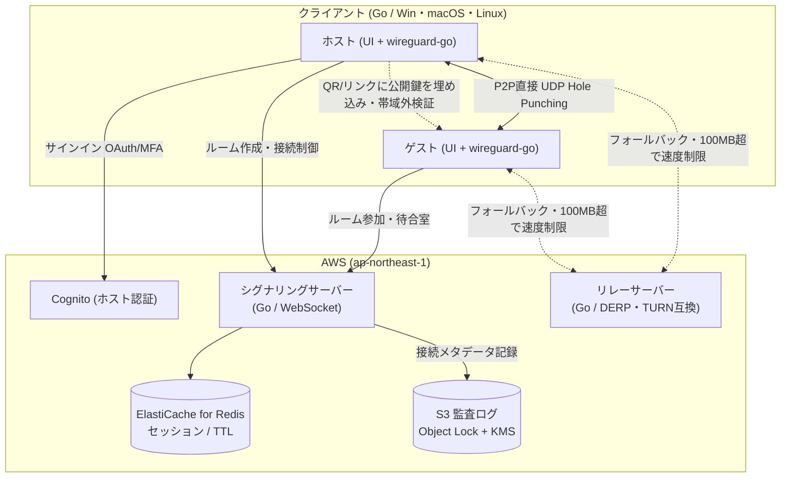

# InstantMesh

**事前設定も面倒な登録もなしに、同じ空間（または一時的なグループ）にいるメンバー間で、安全な仮想ローカルネットワーク（Mesh VPN）を即座に構築できるソフトウェア。**

ネットワークを開く人（**ホスト**）だけがアカウントを持ち、参加する人（**ゲスト**）はアカウント登録不要（**アカウントレス**）。使い終われば時間経過で自動的に消滅（**エフェメラル**）し、通信は端末間で**E2E暗号化**されます。

> **ステータス**: フェーズ1の**実装が進行中**です。`docs/` に要件・アーキテクチャ・規約、`CLAUDE.md` に開発ルール、`.claude/skills/` に実装スキルを整備し、コア実装として `pkg/` 配下に UI/トランスポート非依存の純粋ロジック **33 パッケージ（ユニットテスト100%）** と、シグナリング＋リレーサーバー `cmd/server`・クライアント `cmd/client`（既定は GUI モード。ヘッドレス CLI の host/guest も持つ）を実装済みです。制御プレーン（ルーム作成・待合室承認・キック・エフェメラル管理）とデータプレーン（リレー中継・通信量制限）、クライアントの鍵生成・招待リンク（帯域外MITM照合）・STUN・wireguard-go 設定・仮想NICへのIP付与・**P2P直通の成否検知とリレーへの自動フォールバック**・**GUI（LocalAPI＋埋め込み SPA。Windows は WebView2・Linux は Chromium `--app` のアプリ内ウィンドウ）**・**Cognito 認証（PKCE）／S3 監査**までが動作します。**2台の実機（ParrotOS×2・VMware NAT モード）でメッシュ疎通（仮想NIC生成・割当IP経由の `ping`）を確認済み**です。残りは独立した実NAT間での穴あけ確立／直通⇄リレー切替の疎通検証（今回は同一 NAT 配下のため経路判定は未確認）です。進捗の詳細は [`TODO.md`](TODO.md) を参照。

---

## 解決する課題

ローカルAI（Dify＋ローカルLLM 等）やリモート開発の現場では、**「手軽さ」と「セキュリティ」がトレードオフ**になりがちです。

- 機密データを外部クラウドに出さないためローカルにLLM/開発サーバーを閉じ込めているのに、社外テスターやスマホ実機から検証する際に `ngrok` 等でパブリックURLを露出させ、中央集権の海外サーバーを経由してしまう（＝ローカルに閉じ込めた意味が崩壊する）。
- かといって既存のメッシュVPN（Tailscale / ZeroTier / NetBird）は**全員のアカウント登録と常設セットアップ**が前提で、「ちょっとだけ一緒に繋ぎたい」用途にはオーバースペック。

InstantMesh は「**必要なときだけ即席で張り、終われば自動で消える**」クローズドなP2Pネットワークでこれを解消します。

### プライマリ・ペルソナ
**ローカルAI／リモート開発者および小規模開発チーム。** 既存VPNの常設セットアップ・ポート開放・固定的なアカウント管理を避けつつ、開発リソースを一時的かつ安全に共有したい層。プラン・ポート制限・成功指標・訴求はすべてこの層に従属させます（ゲーマー／イベント等のカジュアル層は主対象外）。

---

## 主な特徴

- 🔓 **アカウントレス参加** — ゲストはQR/リンクから参加。使い捨てのルームトークンと一時的なデバイス識別子（WireGuard公開鍵）で識別。
- ⏳ **エフェメラル（自動消滅）** — 制限時間経過・純アイドル30分・ホストの解散で、ルームと仮想NIC/設定を自動クリーンアップ。
- 🔒 **E2E暗号化 P2P** — WireGuard ベース。サーバーは通信内容を復号・閲覧・保存しない。
- 🕳️ **NATトラバーサル** — STUN による UDP Hole Punching で直接接続。失敗時のみ暗号化パケットをリレー中継。
- 🛡️ **MITM対策（帯域外鍵検証）** — QR/招待リンクにホスト公開鍵を埋め込み、シグナリングサーバーを経由しない照合で中間者攻撃を無効化。承認時はゲスト公開鍵の短縮フィンガープリント（SAS）を表示。
- 🚪 **待合室承認＆キック** — ホストが個別に承認/拒否。キックは公開鍵ベースのブラックリストで再参加もブロック。
- 🖥️ **デスクトップ3種対応**（フェーズ1） — Windows / macOS / Linux。

---

## 使い方（UXフロー）

### ホスト（ネットワーク作成者）
1. アプリを起動し、GitHub または Google で1クリックログイン（MFAは任意・推奨）。
2. 「ルームを作成」。接続用の **QRコード**／**招待リンク**が表示される（ホスト公開鍵フィンガープリントを含む）。
3. 制限時間を設定（無料版：最大1時間／有料版：最大24時間）。
4. 待合室の参加リクエストを、ゲストの**SASとニックネーム**を確認して承認/拒否。
5. URL漏洩時は「招待リンク再発行」で既存メンバーを維持したままローテーション（旧URLは即時無効）。不審なゲストは「キック」。

### ゲスト（参加者）
1. アプリを起動し、ログインせず「ルームに参加」。
2. ホストのQRをスキャン、またはリンクを入力。
3. 一時的なニックネームを入力してリクエスト → 待合室で待機。
4. ホストが承認すると、登録なしで即座に仮想ネットワークへ参加。
5. 割り当てられたプライベートIP（例: `10.0.0.x`）でメンバー間通信（Ping、割当IP経由のローカル共有、ローカルサーバーへのアクセス等）を開始。

> 「ファイル共有」は割当IP経由で SMB 等のローカル共有に到達できるという**接続性の説明**であり、専用のファイル共有機能を提供するものではありません。

---

## アーキテクチャ概要

接続の仲介を行う**コントロールプレーン**と、実データ（VPNトラフィック）を処理する**データプレーン**を分離。シグナリングとリレーはコード上論理的に分離し、フェーズ1は最小構成で運用しつつ、スケール時に別インスタンス／マルチAZへ切り出せる設計とします。



詳細なコンポーネント定義・接続シーケンス・セキュリティ設計は [`docs/システムアーキテクチャ定義書.md`](docs/システムアーキテクチャ定義書.md) を参照してください。

---

## 技術スタック

| レイヤー | 採用技術 |
| :--- | :--- |
| **言語** | Go（サーバー・クライアント共通） |
| **VPNエンジン** | `wireguard-go`（ユーザースペース実装、OSカーネル非依存）、暗号は `ChaCha20-Poly1305` |
| **クライアントUI** | **Tailscale の LocalAPI 方式**（localhost HTTP サーバー＋埋め込み SPA。コアの表示状態を JSON 配信し UI は薄い購読層に徹する）。仮想NICに Wintun 等を使用（初回のみ管理者権限） |
| **NAT越え／リレー** | STUN（Hole Punching）、DERP／TURN 互換リレー |
| **シグナリング** | Go WebSocket（`gorilla/websocket` 等） |
| **セッション管理** | Amazon ElastiCache for Redis（TTLでルーム自動消滅） |
| **ホスト認証** | Amazon Cognito（Google / GitHub OAuth、TOTP MFA 任意） |
| **監査ログ** | Amazon S3（Object Lock 改ざん防止 ＋ KMS 暗号化 ＋ 最小権限） |
| **コンピュート** | Amazon EC2（`t4g` / Graviton） |
| **リージョン** | `ap-northeast-1`（東京）固定 — 個人データの越境移転なし |

---

## セキュリティ設計

- **E2E暗号化**: データプレーンの全パケットは端末間で直接暗号化/復号。サーバーは共通鍵・秘密鍵を一切持たず、侵害されても通信内容を復号・盗聴できない。
- **鍵交換の完全性（MITM対策）**: 公開鍵はQR/招待リンクに埋め込み、シグナリングを経由しない帯域外で照合。不一致なら接続中止。「サーバー侵害時も盗聴不可能」の根拠は E2E そのものではなく**帯域外での鍵照合**にある（安全な経路でのQR/リンク共有が前提）。
- **承認前ネットワーク隔離**: 待合室段階のゲストには WireGuard ピア未追加・仮想IP未割当（シグナリング接続のみ）。
- **キック（再参加ブロック）**: 対象の公開鍵＋ルームトークンをブラックリスト登録。トークン失効だけでは新トークンで復帰可能なため**公開鍵ベースのブロックを主**とする。
- **秘密鍵管理**: WireGuard秘密鍵はメモリロック（mlock）・使用後ゼロ化・スワップ抑止で、ディスク／スワップへ書き出さない。
- **監査ログ（法的防衛線）**: 「どのホストが・いつルームを作成し・どのIPのゲストが参加したか」の**接続メタデータのみ**を保持（通信内容は保持しない）。保持期間は原則3ヶ月（電気通信事業法の該当性判定を踏まえ確定・並行タスク）。
- **レート制限**: 参加申請（1トークン／1IP）とルーム作成（1アカウント）に上限を設け、踏み台DoS・リソース枯渇を防止。

---

## プラン別仕様

> 有料プランの提供機能は**仕様として確定**していますが、**決済・課金の実装は後続フェーズ**です。フェーズ1は無料プラン相当で動作します。数値は要件定義書（唯一のマスター）に準拠。

| 機能項目 | 無料プラン（Free） | 有料プラン（Pro） |
| :--- | :--- | :--- |
| ホストのアカウント | 必須（無料） | 必須（サブスクリプション） |
| ゲストのアカウント | 完全不要 | 完全不要 |
| 最大ゲスト数 | **5** / ルーム | **20** / ルーム |
| 最大制限時間 | **1時間** / 回 | **24時間** / 回 |
| リレー通信量制限 | 1接続100MB到達で64kbpsへ速度制限 | 制限緩和（または従量課金） |
| 無通信タイムアウト | 30分（純アイドル）で自動解散 | 30分（純アイドル）で自動解散 |
| 招待URL再発行 | 利用可 | 利用可 |
| ホストMFA | 任意（推奨） | 任意（推奨） |

ポートによる制限は設けません（全ポート開放）。E2E 暗号化された直通経路はサーバーからポート単位で選別できず、クライアント側フィルタは改変でバイパスされうるため、ポート制限は悪用抑止として実効性がなく撤廃しました。悪用抑止は強制可能なレイヤ（リレー通信量制限・レート制限・監査ログ）で担保します。

---

## スコープ（フェーズ1）

**やること**
- デスクトップ3種（Windows / macOS / Linux）向けのアカウントレス即席 Mesh VPN。
- ホスト認証、ルーム作成・待合室承認・キック、エフェメラルなライフサイクル管理。
- 無料／有料のプラン差の**仕様定義**（機能制限の実装を含む。決済は除く）。

**やらないこと（後続フェーズ）**
- 決済・課金の実装。
- モバイル（iOS / Android）対応。
- GPUマーケットプレイス等の派生プロダクト（下記「将来展望」）。
- マルチAZ／完全冗長化構成（フェーズ1は最小構成で開始し、単一障害点は既知リスクとして受容）。

**成功指標**（検証仮説1本＋合否基準）
- 検証仮説: 「ローカルAI／リモート開発者は、アカウントレスな即席VPNに継続的な利用価値を見出す」。
- 合否基準（仮）: ルーム再作成（リピート）率 **≥ 40%** ／ P2P直接接続成功率 **≥ 80%** ／ 主要フローでクリティカルなUXブロッカーが発生しないこと。

---

## 将来展望

フェーズ1で「セキュアかつ低遅延なP2Pネットワーク基盤」を完成させたのち、そのコア通信機能（P2P・NATトラバーサル・リレー）を **SDK / ライブラリ**として切り出し、別プロダクトである **C2C GPUシェアリング・マーケットプレイス**の通信基盤として内部利用する構想です。GPUの貸し手／借り手を直接マッチングし、ポート開放不要でセキュアに接続するトンネルとして本技術を応用します（GPUマーケットプレイスは双方アカウント必須の別ブランド）。

---

## プロジェクト構成

```
instant-mesh/
├── docs/            # 要件・アーキテクチャ・規約・競合分析
├── CLAUDE.md         # 開発ルール（設計原則・コーディング規約）
├── .claude/skills/   # 開発領域別＋横断の実装スキル（Claude Code が自動ロード）
├── cmd/
│   ├── server/      # シグナリング(/ws)＋リレー(/relay)サーバー
│   └── client/      # クライアント（既定 GUI モード＋ヘッドレス CLI）・シグナリング/P2P
└── pkg/             # UI/トランスポート非依存のコアロジック（純粋・SDK化を見据えた分離）
    ├── plan / nickname / token / ipam / ratelimit / clientip  # ドメイン基礎（プラン/表示名/招待トークン・SAS/IP割当/レート制限/信頼プロキシ実IP解決）
    ├── room / manager                              # ルーム集約・複数ルームのゴルーチンセーフ管理
    ├── signaling / session / hub / cognitojwt / auditlog  # 制御プレーン（メッセージスキーマ・純粋ディスパッチャ・接続配線・Cognito JWT 検証・監査ログのバッチ/シリアライズ）
    ├── relay / relayhub / relayframe               # データプレーン（リレー中継・通信量メータ/スロットル・ワイヤフレーム）
    ├── stun / stunmux / wgstat / connmon           # NATトラバーサル（STUN・WGソケット相乗り・直通成否検知・直通⇄リレー状態機械）
    └── wgkey / secret / invite / qr / signalclient / wsconn / wgconf / meshpeer / netcfg / appstate / originguard / oauthpkce  # クライアント基盤（鍵・秘密情報の安全保持・招待・QR画像化・シグナリング・WG設定・ピア写像・NIC設定・GUIビューモデル・LocalAPI防御・OAuth PKCE 認可）
```

各パッケージの役割と進捗は [`TODO.md`](TODO.md) を参照。テストカバレッジは CI（GitHub Actions）の `go test ./... -cover` で確認でき、純粋ロジック（`pkg/`）は全パッケージ 100% カバレッジを維持しています。

### 設計原則（`CLAUDE.md` より）
- **UIとコアロジックの完全分離**: 接続制御・シグナリング・WireGuard制御・NATトラバーサル等のコアは `pkg/` 配下の独立パッケージとし、UI（`cmd/client/`）やサーバー（`cmd/server/`）から呼び出す（将来のSDK化を見据える）。
- **E2E暗号化の厳守**: サーバーは復号鍵を一切受信・保持しない。扱うのは公開鍵とメタデータのみ。
- **秘密情報のメモリ内管理**: WireGuard秘密鍵・一時トークンはディスクに保存せず、メモリ上で生成・保持し、終了時にゼロクリア。
- **Go規約**: 標準構成（`cmd/`・`pkg/`）、goroutine は `context.Context`／チャネルでキャンセルライフサイクルを持たせる、エラーはコンテキストを付与して伝播。

---

## ドキュメント

| ドキュメント | 内容 |
| :--- | :--- |
| [使い方ガイド（開発版）](docs/使い方.md) | 現在の実装（`cmd/server`・`cmd/client`）を実際に起動して動かす手順。サーバーの役割・置き場所・CLI/GUI・フラグ一覧・最短手順 |
| [要件定義書](docs/要件定義書.md) | フェーズ1の要件マスター（機能／非機能／プラン／状態遷移。付録にレビュー結果・対応方針） |
| [システムアーキテクチャ定義書](docs/システムアーキテクチャ定義書.md) | 全体構成図・接続シーケンス・セキュリティ設計 |
| [プロダクトビジョン](docs/vision.md) | 解決する課題とユースケース戦略 |
| [競合分析＆マネタイズ計画書](docs/競合分析_マネタイズ計画書.md) | 競合比較（VPN／C2C GPU）とマネタイズ戦略 |
| [利用規約](docs/利用規約.md) | Terms of Service |
| [開発ルール](CLAUDE.md) | 設計原則・コーディング規約 |

---

## ライセンス

未定（確定は並行タスク）。サービス利用条件は [利用規約](docs/利用規約.md) を参照してください。
