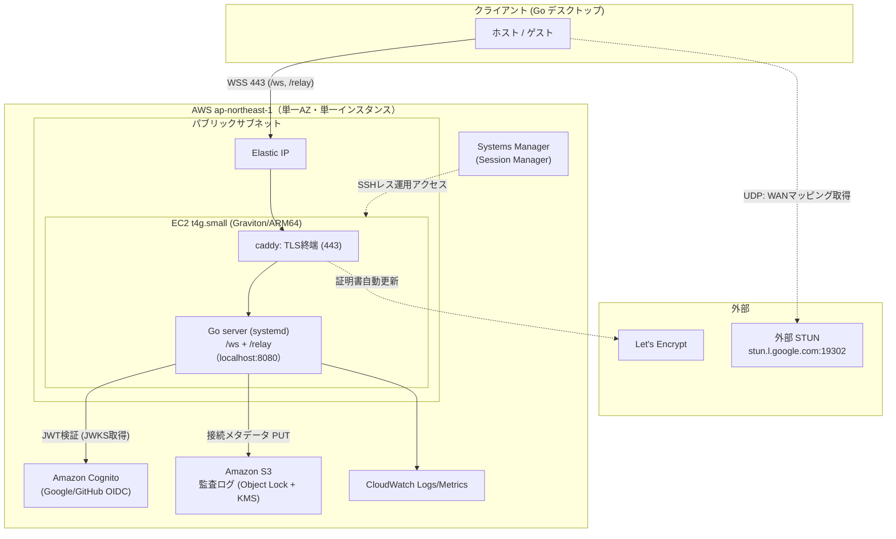
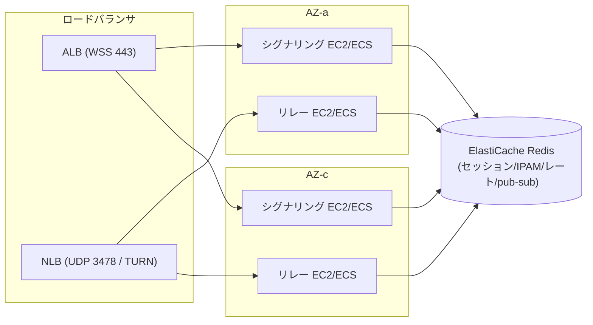

# AWS 展開設計書：InstantMesh（サービス化フェーズ）

本書は、フェーズ1で単一プロセス・インメモリ実装として完成しているサーバー（`cmd/server`）を、**常時稼働するサービスとして AWS（`ap-northeast-1`）へ展開する**ための具体的な移行計画を定義する。

`docs/システムアーキテクチャ定義書.md`（§2.2 コントロールプレーン／§2.3 データプレーン）が示す本番像（Cognito・ElastiCache Redis・S3・EC2）を、**コストと実装量に見合うよう2ステージに分割して具体化**したもの。上位文書と矛盾する記述があれば本書の段階論が優先する（実装順序の正）。

- 最終更新: 2026-07-16
- 対象: `cmd/server`（`/ws` シグナリング＋`/relay` リレー）
- 確定した初期方針（本書 §2 で詳述）: **ステージ1 MVP から着手 / EC2＋systemd / 小規模（〜数十ルーム同時）/ Redis 不要 / 単一 AZ の単一障害点を受容**

---

## 1. 設計原則の再確認（AWS 展開でも不変）

`CLAUDE.md`（設計原則）の原則は本番でも厳守する。特に AWS 展開で効くもの:

1. **E2E 暗号化の厳守**: シグナリング／リレーサーバーは WireGuard 秘密鍵などの復号鍵を一切受信・保持しない。サーバーが侵害されても通信内容は復号できない。リレーは宛先公開鍵で暗号化ペイロード（`pkg/relayframe`）を素通し転送するだけ。
2. **監査ログは接続メタデータのみ**: 「どのホストが・いつルーム作成／どの IP のゲストが参加」のみを S3 に記録。ペイロードは一切保存しない（`auditlog.Event` の型がこれを保証）。
3. **越境移転を発生させない**: 全リソースを `ap-northeast-1`（東京）に配置。
4. **既存コアは書き直さない**: `pkg/` の純粋ロジックには手を入れず、`cmd/server` の I/F 実装を差し替えることで本番化する（次章）。

---

## 2. 現状のコード境界（差し替えの接点）

サーバーは現在**全状態インメモリ・単一プロセス**で、外部ストアへの依存はゼロ。本番差し替えを見据えた **3 つの I/F 境界**と、水平スケール時に問題化する **3 つのプロセスローカル状態**が実装済みである。

### 2.1. 差し替え用インターフェース（既に I/F 化済み）

| 関心事 | I/F 定義 | 現行モック | 本番実装先 |
| :--- | :--- | :--- | :--- |
| ホスト認証 | `Authenticator`（`cmd/server/auth.go`、`Authenticate(r) (hub.Auth, error)`） | `DevAuthenticator`（Bearer をアカウント ID とみなすだけ・署名/失効/発行元を検証しない） | **Cognito JWT 検証（実装済み：`cmd/server/cognito.go`＋`pkg/cognitojwt`）** |
| 監査ログ | `AuditLogger`（`cmd/server/audit.go`、`Log(auditlog.Event)`） | `SlogAuditLogger`（`log/slog` 出力のみ） | **S3（Object Lock + KMS）（実装済み：`cmd/server/s3audit.go`）** |
| リレー認可 | `RelayAuthorizer`（`cmd/server/relay.go`、`Authorize(roomID, pubKey) (roomKey, spec, err)`） | `managerAuthorizer`（共有 `*manager.Manager` を直参照） | ステージ1では変更不要（§3.5） |

いずれも `buildServer`（`cmd/server/main.go`）で注入している。Cognito／S3 版は**実装済み**で、フラグ（`-cognito-issuer`＋`-cognito-audience`／`-audit-s3-bucket`）指定時にモックから切り替わる。**`pkg/` および I/F シグネチャは不変**。

### 2.2. プロセスローカルな状態（水平スケールの壁）

| 状態 | 保持箇所 | 内容 |
| :--- | :--- | :--- |
| コントロールプレーン | `pkg/manager` | ルーム／トークン索引・IPAM の /24 払い出し・ルーム作成レート制限（すべて単一 `sync.Mutex` 配下の map） |
| 接続レジストリ | `pkg/hub` | connID → 状態、roomID → ホスト/ゲストの connID。宛先解決に使う |
| リレー転送表 | `pkg/relayhub` | roomKey → 宛先公開鍵 → 実 WebSocket 接続。`Forward` は同一プロセス内の宛先へのみ送出 |

ステージ1（単一インスタンス）ではこれらはインメモリのままで正しく動く。**ステージ2（複数インスタンス）で初めて障壁になる**（§7 で対処）。

---

## 3. ステージ1：サービス化 MVP（確定・実装対象）

「常時稼働・アカウント登録できるサービス」を**最小コスト・最小実装**で立ち上げる。**サーバーの状態層（`pkg/manager`/`hub`/`relayhub`）には一切触れず**、§2.1 の 2 つの I/F（認証・監査）を差し替えるだけで到達する。

### 3.1. 構成図

### 3.2. コンピュート／ネットワーク

- **EC2 `t4g.small`（Graviton / ARM64）1 台 + Elastic IP**。Go 実装は ARM で高コスパ。既存 CD（`.github/workflows`）が生成する ARM64 Linux バイナリをそのまま配置する。
- **VPC はパブリックサブネット 1 つで足りる**（小規模・単一 AZ を受容）。将来のマルチ AZ 化に備え、サブネットは 2 AZ 分だけ切っておく（EC2 は片方に 1 台）。
- **常駐は systemd**（`Restart=always`、`WatchdogSec` 任意）。プロセス異常時に自動再起動。

### 3.3. TLS 終端：caddy 自前終端を採用（ALB は使わない）

小規模・単一台では ALB（月 ~$18〜）は割に合わないため、**EC2 上の caddy で TLS を終端**する。

- caddy が **Let's Encrypt 証明書を自動取得・更新**し、WSS(443) を `localhost:8080` の Go サーバーへリバースプロキシする。WebSocket のアップグレードは caddy がネイティブに透過。
- Go サーバーは **localhost 平文で待ち受け**る（`-addr 127.0.0.1:8080`）。`cmd/server` の `warnIfInsecureBind` は非ループバック bind 時のみ警告するため、localhost bind なら実害なし。
- **代替案（将来）**: ステージ2 でインスタンスを増やす際は ALB + ACM で WSS を終端し、UDP を扱う STUN/TURN は NLB へ分離する（§7）。MVP では採らない。

### 3.4. ホスト認証：Amazon Cognito

- **User Pool を 1 つ**作成し、**Google / GitHub を OIDC IdP 連携**。MFA（TOTP）は任意で提供。
- クライアントが PKCE で ID トークン（JWT）を取得 → WSS の `Authorization: Bearer <JWT>` で送信 → **`Authenticator` の Cognito 実装**が JWKS で署名検証・`iss/aud/exp` 検証を行い `hub.Auth`（role/accountID/pubKey/tier）を生成する。**実装済み（S1-1）**: クライアント側は純粋ロジック `pkg/oauthpkce`（PKCE・URL 構築・応答解析）＋ `cmd/client/cognitoauth.go`（ループバックコールバック＋ブラウザ起動＋token 交換）。フラグ `-cognito-domain`/`-cognito-client-id`/`-cognito-redirect`/`-cognito-scope`。
- **プラン(tier)は署名検証済みトークンの `cognito:groups` から判定する（S1-1・実装済み）**。フラグ `-cognito-pro-group`（既定 `pro`）に一致するグループ所属で Pro、非所属は fail-safe に Free。改ざん可能なクエリ `?tier=` は Cognito 認証経路では廃止（DevAuthenticator のみ暫定で残す）。実際の Cognito グループ作成・割当は S1-3（IaC）。
- **ゲストは Cognito を通さない**（使い捨てルームトークンのみ）。この非対称は既存設計のままで変更不要。
- 公開鍵の形式検証（`wgkey.ValidatePublicKey`）は現行 `DevAuthenticator` と同様に維持する。

### 3.5. 監査ログ：Amazon S3

- **バケットを 1 つ**作成し、**Object Lock（WORM・改ざん防止）＋ SSE-KMS ＋ IAM 最小権限**で保護。ライフサイクルで保持 3 ヶ月（仮・電気通信事業法の該当性判定を踏まえ確定）。
- **`AuditLogger` の S3 実装**を追加。1 イベント 1 PUT はコスト・レイテンシとも不利なので、**ctx 付きゴルーチンでバッファリングし定期／サイズ閾値でフラッシュ**（例: 日次 or N 件ごとに 1 オブジェクト、NDJSON）。ゴルーチンは `serve` のライフサイクルに束ね、シャットダウン時にフラッシュしてから終了する。
- **ペイロード非保存**は `auditlog.Event` の型で担保済み。実装でこの契約を破らない。
- `RelayAuthorizer` は同一プロセスで manager を共有するため、**ステージ1では現行 `managerAuthorizer` のまま**動く（差し替え不要）。

### 3.6. セッション：インメモリのまま

`pkg/manager`/`hub`/`relayhub` は**変更しない**。再起動で全ルームが消えるが、エフェメラル前提のサービスなので許容する（`docs/システムアーキテクチャ定義書.md` §5-3 の受容リスク）。

### 3.7. STUN の扱い（重要な判断）

- **MVP では外部 STUN（`stun.l.google.com:19302`）を継続利用**する（クライアントの現行既定）。これにより**サーバー側で UDP を公開する必要がなく、セキュリティグループは TCP 443 のみ**で済む。`/relay`（データプレーンのフォールバック）も WSS(443) を通るため、公開ポートは 443 一本に集約できる。
- **トレードオフ**: 外部 STUN 依存は「Google STUN がブロックされる環境・可用性・レート」のリスクを持つ。
- **後続オプション**: サービスとして信頼性を詰める段階で、**自前 STUN**（`pkg/stun` を UDP 3478 で公開 or coturn）を導入する。その時点で SG に `UDP 3478` を追加する（`docs/システムアーキテクチャ定義書.md` §3 の SG 定義はこの自前 STUN 導入後の姿）。

### 3.8. セキュリティグループ（ステージ1）

| プロトコル | ポート | ソース | 用途 |
| :--- | :--- | :--- | :--- |
| TCP | 443 | `0.0.0.0/0` | WSS（`/ws` シグナリング ＋ `/relay` リレー） |
| TCP | 80 | `0.0.0.0/0` | Let's Encrypt HTTP-01 チャレンジ（caddy・任意。TLS-ALPN-01 なら不要） |

- **SSH(22) は開けない**。運用アクセスは **SSM Session Manager**（インスタンスロールに `AmazonSSMManagedInstanceCore`）。
- 自前 STUN を導入したら `UDP 3478`（`0.0.0.0/0`）を追加。

### 3.9. IAM / 運用・監視

- **EC2 インスタンスロール**: `s3:PutObject`（監査バケット限定）＋ KMS `Encrypt`／`GenerateDataKey`（監査キー限定）＋ SSM コア。Cognito JWKS は公開 HTTPS なので権限不要。**最小権限**を徹底。
- **S3 は VPC Gateway Endpoint** を張り、監査ログ PUT を NAT/インターネット経由にしない（コスト減・経路縮小）。
- **CloudWatch Agent** で systemd ジャーナル → CloudWatch Logs、基本メトリクス（CPU/メモリ/ディスク）を送出。最低限のアラーム（インスタンス Status Check 失敗・CPU 高止まり）を設定。

---

## 4. コスト概算（東京・オンデマンド / 要最新確認）

| 項目 | 概算（月） | 備考 |
| :--- | :--- | :--- |
| EC2 `t4g.small` | ~$16 | Savings Plans / RI で半額圏 |
| Elastic IP | $0 | インスタンスに関連付け・稼働中は無料 |
| S3（監査ログ） | <$1 | メタデータのみ・微量 |
| Cognito | ~$0 | 小規模は無料利用枠内の想定 |
| データ転送（egress） | 僅少 | P2P 直通はサーバーを通らない。リレー経由分のみ |
| **合計** | **~$20〜30** | ALB を使わないぶん安価 |

数値は変動するため、IaC 反映前に最新料金で再見積もりする。

---

## 5. コードに入れる変更（ステージ1）

`pkg/` は不変。`cmd/server` に I/F 実装を足して注入を差し替える。**1・2 は S1-1／S1-2 として実装済み**（本節は設計意図の記録も兼ねる）。

1. **Cognito 認証実装**（`cmd/server`）**〈実装済み〉**
   - JWKS 取得＋キャッシュ（TTL・鍵ローテーション追従）は I/O アダプタとして `cmd/server`（`cmd/server/cognito.go`）に置いた。
   - **JWT の `iss/aud/exp`・クレーム検証の純粋部分は既存の `pkg/cognitojwt`** へ切り出し済み（`now` 注入で決定的テスト・**100% カバレッジ**。`.claude/skills/pkg-pure-logic`）。署名検証で使う公開鍵は引数注入にしてネットワークをテストから排除。クライアント側 PKCE は `pkg/oauthpkce`。
   - `buildServer`（`main.go`）で `DevAuthenticator` → `CognitoAuthenticator` へ差し替え済み（フラグ指定時）。
2. **S3 監査実装**（`cmd/server`）**〈実装済み〉**
   - `AuditLogger` の S3 実装（バッファ＋定期フラッシュ、ctx／チャネルでキャンセルライフサイクルを持たせリーク防止）を `cmd/server/s3audit.go` に追加済み。`buildServer` で `SlogAuditLogger` → S3 実装へ差し替え（フラグ指定時）。
3. **フラグ／設定**
   - Cognito（User Pool ID・region・app client）・S3（バケット・KMS キー）・フラッシュ間隔などを環境変数／フラグで注入。秘密情報はディスクに置かず環境・インスタンスロールで供給。
4. **`-addr` を `127.0.0.1:8080` に**（caddy 終端前提）。

> 実装着手時は `.claude/skills/cmd-transport-wiring`（I/F 注入・配線）と `.claude/skills/pkg-pure-logic`（純粋ロジック分離）を参照する。

---

## 6. IaC 構成

- **AWS CDK（Python）を採用**（プロジェクト決定・当初案の Terraform から変更）。**IaC は本リポジトリではなく別リポジトリで管理する**（`npx aws-cdk synth` で認証情報なしに構文検証でき、`cdk deploy` で実プロビジョニングする）。以下を再現可能にする（設計対象。実装状況は IaC リポジトリ側で管理）:
  - ネットワーク: VPC / パブリックサブネット（2 AZ 分の枠）/ IGW / ルート / S3 Gateway Endpoint / SG（443・80）
  - コンピュート: EC2（`t4g.small` / AL2023 ARM64）/ EIP / インスタンスロール（最小権限）/ user-data（caddy＋バイナリ配置＋systemd unit）
  - 認証: Cognito User Pool / Hosted UI ドメイン / 公開アプリクライアント（PKCE・ループバックコールバック）/ `pro` グループ。IdP 連携（Google・GitHub）は未設定（client 秘密は state に平文で残さず SSM Parameter Store SecureString 参照とする方針）
  - 監査: S3 バケット（Object Lock 有効・バージョニング・SSE-KMS・ライフサイクル）/ KMS キー
  - 監視: CloudWatch 基本アラーム（Status Check 失敗・CPU 高止まり）/ ロググループ（journald 転送用 CloudWatch Agent は S1-3 フォローアップ）
- **バイナリ配布**: 既存 CD が出す ARM64 Linux バイナリを GitHub Release / S3 から user-data で取得し配置（`serverBinaryUrl` コンテキスト）。デプロイは「新バイナリ配置 → `systemctl restart`」。
- **state 管理**: CDK/CloudFormation が管理（Terraform の S3＋DynamoDB バックエンドは不要）。初回のみ `cdk bootstrap`。パラメータは `cdk.json` の context ＋ `-c key=value` で注入。詳細手順は IaC リポジトリの README を参照。

---

## 7. ステージ2：水平スケール／HA（将来指針）

需要が単一インスタンスの限界（数百〜数千ルーム同時）に近づいたら移行する。§2.2 の 3 つのプロセスローカル状態がすべて障壁になる。

| 障壁（プロセスローカル状態） | 対処 |
| :--- | :--- |
| トークン→ルーム解決・IPAM の /24 二重払い出し・レート制限が実効 N 倍（`pkg/manager`） | **ElastiCache Redis** へ移設。トークン索引は共有キー、IPAM は `INCR`/Lua で原子払い出し、レートも共有バケット、ルーム TTL は `EXPIRE`＋Keyspace Notifications で失効を検知し `room_closed` を配送。`manager` の公開 API 契約を満たす Redis バックエンドを用意（インメモリ版とテストを共有できると良い） |
| **接続レジストリ**：ホストとゲストが別インスタンスだとシグナリングが解決不能（`pkg/hub`、最難関） | ①**ルーム単位スティッキールーティング**（同一ルーム＝同一インスタンスへ寄せる。MVP 的に単純）／②**Redis Pub/Sub** でインスタンス間 Envelope 転送 |
| **リレー転送**：宛先ピアが別インスタンスだとサイレントドロップ（`pkg/relayhub`） | 同一ルームを同一リレーへ寄せる（スティッキー）or DERP 的リレーメッシュ。リレーメータ（`pkg/relay`）はアカウント横断集計を Redis へ |

同時に **シグナリングとリレーを別サービスに分離**（EC2 ASG マルチ AZ or ECS/Fargate）し、UDP を扱う STUN/TURN は **NLB** で受ける。ここで初めて `docs/システムアーキテクチャ定義書.md` §2.2/2.3 のフル構成に到達する。

---

## 8. 移行ロードマップ

| # | 作業 | 依存 | 状態 |
| :--- | :--- | :--- | :--- |
| S1-1 | Cognito 認証実装（`pkg/cognitojwt` JWT 検証＋`pkg/oauthpkce` クライアント PKCE〈100%テスト〉、`cmd/server` に JWKS アダプタ・`cmd/client` に PKCE サインイン、`cognito:groups` ベースの tier 判定、`buildServer` で注入） | — | ✅ |
| S1-2 | S3 監査実装（バッファ＋定期フラッシュ、`buildServer` で注入）。実 PUT 導通は S1-3/S1-4 | — | ✅ |
| S1-3 | IaC（**AWS CDK/Python**・**別リポジトリで管理**）: VPC/SG/EC2/EIP/IAM/Cognito/S3/CloudWatch ＋ user-data（caddy＋systemd）。進捗は IaC リポジトリ側で管理 | S1-1, S1-2 | （別リポ） |
| S1-4 | 本番導通確認（Cognito ログイン→ルーム作成→ゲスト参加→P2P/リレー） | S1-3 | ⬜ |
| S2-1 | （将来）自前 STUN（UDP 3478）導入・SG 追加 | S1-4 | ⬜ |
| S2-2 | （将来）ElastiCache Redis バックエンド（`manager` 契約実装） | S1-4 | ⬜ |
| S2-3 | （将来）接続レジストリの分散化（スティッキー or Redis Pub/Sub）・シグナリング／リレー分離・マルチ AZ | S2-2 | ⬜ |

---

## 9. 未決事項

- **保持期間 3 ヶ月の確定**: 電気通信事業法の該当性判定（並行タスク）を踏まえて確定。利用規約と整合。
- **自前 STUN の要否・時期**: 外部 STUN 依存のリスクをどこまで許容するか。ステージ1 は外部で開始。
- **S3 監査のバッチ粒度**: フラッシュ間隔／オブジェクト単位（日次 vs 件数）。障害時のロスト許容と検索性のトレードオフ。
- **Cognito のセルフサインアップ可否**: 招待制にするか一般公開にするか（マネタイズ計画と整合）。
