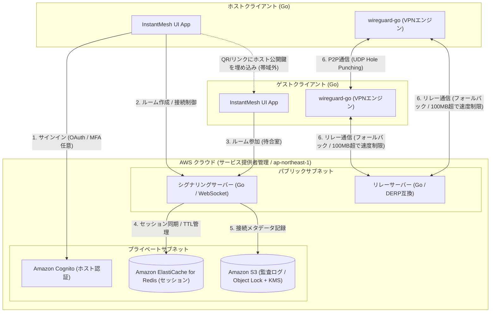
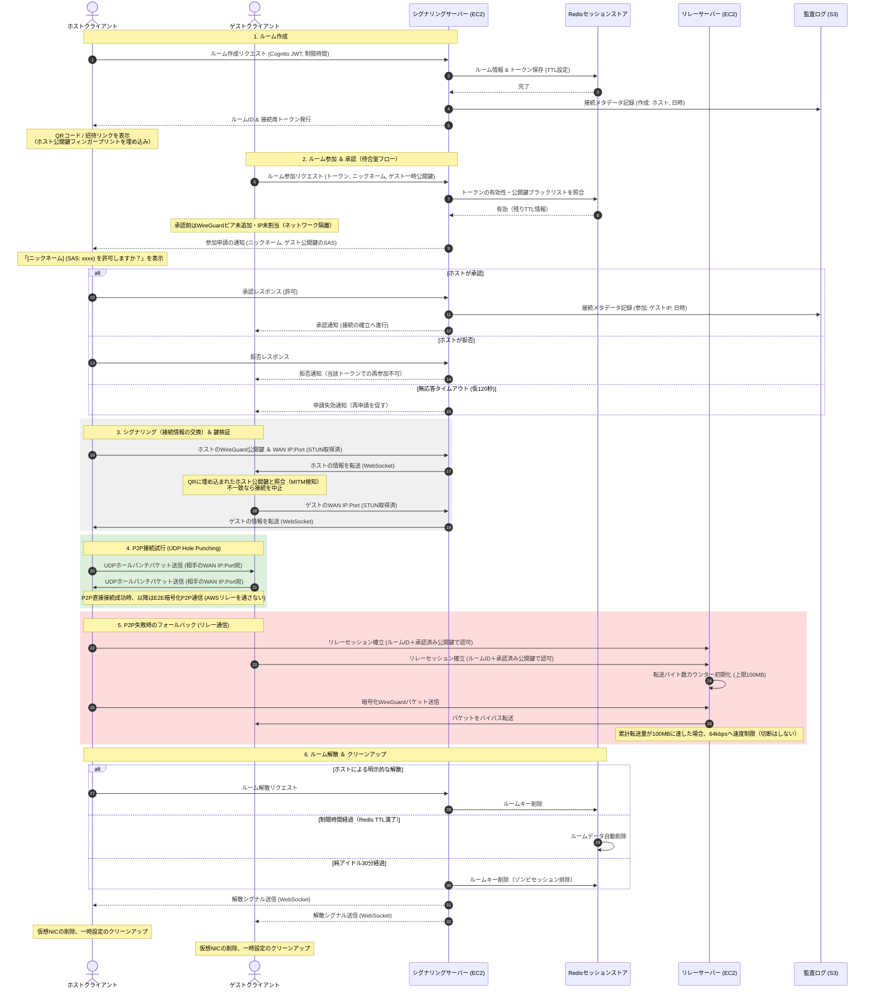

# システムアーキテクチャ定義書：InstantMesh

本書は、アカウントレスで即座に仮想ローカルネットワークを構築する「InstantMesh」のシステム全体像、各コンポーネントの役割、接続シーケンス、およびセキュリティ設計について定義します。

---

## 1. システム全体構成図

InstantMeshは、接続の仲介を行う**コントロールプレーン**と、実際のVPNトラフィックを処理する**データプレーン**に分離したアーキテクチャを採用しています。シグナリングとリレーはコード上論理的に分離し、フェーズ1では最小構成（同一インスタンス可）で運用しつつ、スケール時に別インスタンス／マルチAZへ切り出せる設計とします。

> **本書の位置づけ（重要）**: 本章以降の AWS 構成（ElastiCache for Redis・Cognito・S3・EC2 など）は**スケールアウトを見据えた目標設計**です。**フェーズ1の現行実装は単一プロセス・インメモリ**で、ルーム情報／トークン索引／TTL・掃除は `pkg/manager`（インメモリ）、キック済み公開鍵のブラックリストは `pkg/room`（`denyKicked`）で保持し、**Redis は未使用**です（`go.mod` に依存なし）。Cognito 認証（`pkg/cognitojwt`・`cmd/server/cognito.go`）と S3 監査（`cmd/server/s3audit.go`）はインターフェース実装済みで、フラグ指定時に有効化されます。Redis 等の外部ストアはインターフェースを温存したまま差し替える前提です（詳細は `docs/AWS展開設計書.md`）。

---

## 2. コンポーネント詳細

### 2.1. クライアントサイド (Go)
ホスト・ゲスト共通のデスクトップ向けアプリケーション（フェーズ1対象: **Windows / macOS / Linux**。モバイルは後続フェーズ）。

*   **InstantMesh UI App**: 
    *   **Tailscale のデスクトップクライアントと同じ LocalAPI 方式**で構築する。コアロジック（接続制御・シグナリング・WireGuard 制御）を担うクライアント本体が **127.0.0.1 のみに bind した localhost HTTP サーバー**を立て、表示状態（`pkg/appstate` のビューモデルを写した JSON スナップショット）を配信し、フロント（埋め込み SPA）はそれを購読して描画し操作を POST で返す薄い層に徹する（設計原則: UI とコアロジックの完全分離）。秘密鍵などの復号鍵は LocalAPI に一切載せない（載せるのは公開鍵・招待・表示メタデータのみ）。
    *   ホストのサインイン、ルーム作成（**ホスト公開鍵を埋め込んだQRコード／招待リンク生成**）、ゲストの参加処理（招待リンクの入力・貼り付け、ニックネーム入力、待合室表示。※QRは現状ホスト側の表示のみでゲスト側のスキャン/読み取りは未実装）、接続承認（**ゲスト公開鍵のSAS表示**）、および接続ステータス（メッシュ参加ピアの一覧・経路 Direct/Relay）の表示を行う。
*   **wireguard-go (VPNエンジン)**:
    *   Go言語で書かれたユーザースペースのWireGuard実装。
    *   OSカーネルのWireGuardに依存せず、アプリ内プロセスとして動作。
    *   接続確立時、OSに対して仮想NIC（Wintun等）の作成とルーティングテーブルの設定を指示する（※初回起動/インストール時に管理者権限が必要）。
    *   **無料版のポート制限**は、クライアント側のデフォルトフィルタとして本エンジン近傍で適用する（緩和策であり、改変によりバイパスされうる点に留意）。
    *   秘密鍵はメモリロック（mlock）・使用後ゼロ化・スワップ抑止により、ディスク／スワップへの露出を防ぐ。

### 2.2. コントロールプレーン (AWS)
接続の仲介、認証、セッションのライフサイクルを管理するサーバー群。

*   **シグナリングサーバー (Amazon EC2 - `t4g.small`)**:
    *   Go言語（`gorilla/websocket`等）で構築された軽量な双方向通信サーバー。
    *   ホストとゲストの間で、WireGuardの公開鍵、一時IPアドレス、およびNATトラバーサルに必要なWAN IP・ポート情報（SDP）を中継（シグナリング）する。
    *   待合室フロー（申請・承認・拒否・無応答タイムアウト・キック）を制御し、参加申請にレート制限を適用する。
    *   接続メタデータ（誰が・いつ・どのIPで接続したか）を監査ログとしてS3へ記録する（通信内容は扱わない）。
*   **Amazon ElastiCache for Redis**:
    *   アクティブなルーム情報（ルームID、トークン、接続中のホスト・ゲストのWebSocketセッションID、キック済み公開鍵のブラックリスト）を保持。
    *   Redisの**TTL（Time to Live）機能**を利用し、設定時間が経過するとルーム情報が自動的に失効・消滅する。
*   **Amazon Cognito**:
    *   ホストユーザーのアイデンティティ管理と認証。Google / GitHubアカウントとのOAuth連携を提供。MFA（TOTP）を任意で提供。
    *   ゲストはCognitoを通さず、使い捨てのルームトークン（128bit以上・CSPRNG生成）のみでシグナリングサーバーにアクセスする。
*   **Amazon S3（監査ログストア）**:
    *   接続メタデータを **Object Lock（改ざん防止）＋KMS暗号化＋最小権限アクセス**で保持（保持期間: 原則3ヶ月・仮）。通信内容（ペイロード）は一切保存しない。

### 2.3. データプレーン (AWS)
暗号化された実データ（VPNトラフィック）を転送するためのネットワーク機能。

*   **リレーサーバー (Amazon EC2 - `t4g.small` / `t4g.medium`)**:
    *   P2P直接接続がファイアウォール（Symmetric NAT等）により失敗した場合のフォールバック用サーバー。
    *   暗号化されたパケットを復号することなくそのまま中継する（Tailscale の DERP 相当の自前リレー。宛先公開鍵ベースの独自フレーム転送で、TURN プロトコルは未実装）。
    *   **コスト・悪用対策**: 各リレー接続のデータ転送量をカウントし、累計100MBに達した時点で該当セッションを**64kbpsへ速度制限**する（切断はしない。P2P直通は無制限）。

---

## 3. 接続・通信シーケンス

ルームの作成から、鍵検証付きの待合室承認、P2P接続試行、リレー接続へのフォールバック、およびルーム解散（自動消滅）までの詳細シーケンス。

---

## 4. データフローとセキュリティ設計

### 4.1. エンドツーエンド (E2E) 暗号化
*   データプレーンを流れるすべてのパケットは、WireGuardによってホスト・ゲスト端末間で直接暗号化/復号されます。
*   暗号化方式には、現代的で安全な `ChaCha20-Poly1305` が使用されます。
*   シグナリングサーバーおよびリレーサーバーは、共通鍵や秘密鍵を一切持ちません。そのため、AWS上のサーバーが侵害されても、通信内容（パケットのペイロード）を復号・盗聴することはできません。

### 4.2. 鍵交換の完全性と中間者攻撃（MITM）対策
*   公開鍵はシグナリングサーバーを介して交換されるため、**シグナリングサーバー自身が侵害された場合、鍵をすり替える中間者攻撃（MITM）が理論上成立し得ます**。E2E暗号化だけではこの経路を守れません。
*   対策として、**QRコード／招待リンクにホストの公開鍵（フィンガープリント）を埋め込み**、シグナリングサーバーを経由しない帯域外（out-of-band）でゲストが照合します。照合に失敗した場合は接続を中止します。これによりシグナリングサーバー侵害時のMITMを検知・遮断します。
*   ゲスト側の識別のため、ホストの承認画面には**ゲスト公開鍵の短縮フィンガープリント（SAS）** を表示します。ニックネームは自己申告（未検証）として扱います。
*   **信頼境界の明示**: 上記により「サーバー侵害時も盗聴不可能」を担保しますが、その根拠はE2E暗号化そのものではなく、帯域外での鍵照合にあります。ユーザーがQR/リンクを安全な経路（対面・信頼できるチャネル）で共有することが前提です。

### 4.3. 接続前アクセス制御とキック
*   **承認前ネットワーク隔離**: 待合室段階のゲストにはWireGuardピアを追加せず、仮想IPも割り当てません。承認されて初めてネットワークに参加します。
*   **キック（再参加ブロック）**: キック時、対象ゲストの**公開鍵をブラックリストに登録**し（フェーズ1は `pkg/room` のインメモリ `denyKicked`。スケール時は Redis 上のブラックリストへ差し替え）、ピア削除・IP回収を行います。トークン失効のみでは新トークンで復帰可能なため、公開鍵ベースのブロックを主とし、ルーム存続中は同一鍵の再参加を拒否します。
*   **レート制限**: 参加申請（1トークン/1IPあたり）およびルーム作成（1アカウントあたり同時数・頻度）にレート制限をかけ、踏み台DoS・リソース枯渇を防ぎます。
*   **招待URL再発行**: セッショントークンを即時再生成して旧URLを無効（404）化します。承認済みピアは維持されるため、既に漏洩した承認済み相手の排除にはキックの併用が必要です。

### 4.4. 監査ログの保護
*   S3へ記録する接続メタデータは、**Object Lock（WORM／改ざん防止）＋KMSによる暗号化＋IAM最小権限**で保護します。
*   保持期間は原則3ヶ月（仮）とし、電気通信事業法の該当性判定（並行タスク）を踏まえて確定します。通信内容（ペイロード）は保存しません。利用規約の記載と整合させます。
*   全リソースをap-northeast-1（東京）に配置し、個人データの越境移転を発生させません。

---

## 5. 制限事項と考慮点
1.  **対称NAT（Symmetric NAT）環境での制限**
    *   両端末が対称NAT（一部の企業用Firewallや特殊な携帯キャリア通信など）の配下にある場合、P2Pの穴あけ（Hole Punching）は技術的に不可能です。この場合は100%リレーサーバー経由になります。リレーも上限に達している等で確立できない場合は、クライアントUIで**接続不可**を明示的に通知します。
2.  **100MB到達後の挙動**
    *   リレー経由で累計100MBに達した場合は**64kbpsへ速度制限**します（切断はしません）。P2Pへの再試行を継続しつつ、速度制限中である旨をクライアントUIでユーザーに分かりやすく提示します。
3.  **単一障害点と段階的な冗長化**
    *   フェーズ1は最小構成（コスト優先）で開始するため、シグナリング／リレーは単一インスタンス構成となり単一障害点を含みます。これは既知リスクとして受容し、スケール時にシグナリング／リレー分離・マルチAZ・冗長化へ移行します。
