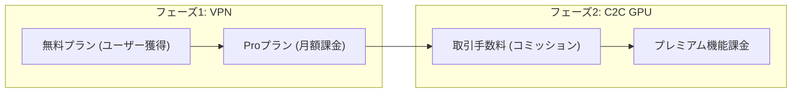

# 競合分析 ＆ マネタイズ計画書：InstantMesh

本書では、InstantMeshの競合となるサービスを「VPN領域」と「将来のC2C GPU領域」の2軸で分析し、InstantMeshならではのマネタイズ戦略を提案します。

---

## 1. 競合分析：VPN領域（フェーズ1の競合）

### 1.1. 競合サービス比較表

| 項目 | **Tailscale** | **ZeroTier** | **NetBird** | **InstantMesh（本プロダクト）** |
| :--- | :--- | :--- | :--- | :--- |
| **概要** | WireGuardベースのメッシュVPN。企業向けに急成長中 | 独自プロトコルのP2P仮想LAN。老舗 | WireGuardベースのオープンソースZero Trust VPN | WireGuardベースの即席VPN。アカウントレス＆一時利用特化 |
| **ターゲット** | 開発者 → 企業のIT部門 | 個人・IoT・中小企業 | セキュリティ重視の中〜大企業 | **同じ空間にいるグループ（ゲーマー、イベント、共同作業者）** |
| **アカウント** | 全員必要（Google/Microsoft等） | 全員必要 | 全員必要（SSO/IdP） | **ホストのみ。ゲストはアカウント不要** |
| **ネットワーク寿命** | 永続的（常時接続） | 永続的 | 永続的 | **一時的（エフェメラル）。時間制限で自動消滅** |
| **無料プラン** | 6ユーザーまで無料 | 10ノードまで無料 | 5ユーザー・100台まで無料 | **基本無料（リレー通信量制限あり）** |
| **収益モデル** | シート課金（PLG → Enterprise） | ノード数課金（Freemium） | アクティブユーザー課金 | **後述（フリーミアム＋将来のGPU手数料）** |
| **技術基盤** | WireGuard + DERP（独自リレー） | 独自プロトコル (ZT) | WireGuard + STUN/TURN | WireGuard + STUN + DERP/TURN互換 |
| **セルフホスト** | 不可（コントロールプレーンはSaaS） | 可能（ztncui等） | 可能（全機能無料） | フェーズ1では不可（SaaS提供） |

### 1.2. InstantMeshの差別化ポイント

既存の競合サービスは全て「**永続的なネットワークを構築し、全員がアカウントを持つ**」ことを前提としています。InstantMeshは以下の点で根本的に異なります。

1.  **アカウントレス参加（ゲスト）**
    * 競合は全員がサービスにサインアップする必要があるため、「ちょっとだけ一緒にLAN接続したい」というカジュアルな利用シーンにはオーバースペックです。
    * InstantMeshは、ゲストはQRコードを読むだけで即座に参加できます。

2.  **使い捨て（エフェメラル）ネットワーク**
    * 競合は「永続的なネットワーク」を管理するツールです。使い終わったら手動でピアを削除したり、ネットワークをアーカイブする必要があります。
    * InstantMeshは、制限時間経過で自動的にネットワークが消滅し、痕跡が一切残りません。

3.  **ユースケースの違い**
    * 競合：企業のリモートアクセス、DevOps、IoTデバイス管理（常時稼働が前提）
    * InstantMesh：**LANパーティ、イベント会場でのファイル共有、ハッカソン、臨時の共同作業、カフェでの一時的なリモート開発環境の共有**（一時利用が前提）

---

## 2. 競合分析：C2C GPU領域（将来フェーズの競合）

### 2.1. 競合サービス比較表

| 項目 | **Vast.ai** | **Akash Network** | **io.net** | **Aethir** |
| :--- | :--- | :--- | :--- | :--- |
| **概要** | 分散型GPUマーケットプレイス | ブロックチェーン基盤の汎用クラウド | AI/ML特化の分散GPUクラスター | エンタープライズ向け分散GPU |
| **ホスト（貸し手）** | 個人〜データセンター | Kubernetesに精通した提供者 | データセンター中心 | 大規模インフラ事業者 |
| **収益モデル** | 取引手数料（コミッション） | リバースオークション | オンデマンド課金 | エンタープライズ契約 |
| **規模（2026年）** | GPU 約20,000基、月間14,000+有料ユーザー | 確立された実績あり | AI/ML特化で急成長 | 大規模推論・クラウドゲーミング |
| **価格帯** | AWS比 3〜5倍安い（動的価格） | オークション方式で変動 | オンデマンド（AWS比で安価） | AWS比 40〜80%安い |
| **参入障壁** | 低い（個人PCでも提供可） | 高い（Kubernetes知識が必要） | 中程度 | 高い（エンタープライズ向け） |

### 2.2. InstantMeshが将来参入する際の差別化

* **「ネットワーク接続」の問題を解決済み**: 既存のGPUマーケットプレイスは、借り手がホストのGPUマシンに接続するためにSSHトンネルやポート転送などの設定が必要です。InstantMeshは、NATの壁を超えてポート開放不要で即座にセキュアな接続を構築できるため、接続のUXで圧倒的に優位になります。
* **個人ユーザーへの低い参入障壁**: Vast.aiは「Dockerイメージの選択」「Jupyter Notebookの起動」など一定のリテラシーが求められます。InstantMeshは「QRコードを読むだけ」というシンプルさを武器に、より幅広い個人ユーザーを取り込める可能性があります。

---

## 3. マネタイズ戦略

### 3.1. 全体方針：段階的フリーミアム ＋ プラットフォーム手数料

---

### 3.2. フェーズ1：VPNサービスのマネタイズ

#### 料金プラン案

| プラン | 価格 | 内容 |
| :--- | :--- | :--- |
| **Free** | ¥0 | ルーム作成可能（最大3ゲスト）、制限時間は最大1時間、リレー通信量100MB/接続 |
| **Pro**（個人向け） | ¥500〜800/月 | ルーム作成可能（最大10ゲスト）、制限時間は最大8時間、リレー通信量500MB/接続、優先リレーサーバー |
| **Team**（チーム向け） | ¥2,000〜3,000/月 | ルーム作成可能（最大30ゲスト）、制限時間は最大24時間、リレー通信量無制限、接続ログ・監査機能 |

#### 無料プランの戦略的意義（PLG: Product-Led Growth）
* Tailscaleと同様に、**「まず無料で使ってもらい、便利さを体感してもらう」** ことでオーガニックな口コミ拡大を狙います。
* 無料プランの制限（3人まで、1時間まで）は、**「もっと大人数で」「もっと長時間」** 使いたくなった時に自然とProプランへ誘導するための設計です。

#### 追加の収益オプション
* **ワンタイムパス（都度課金）**: 月額ではなく「1回だけ10人のルームを8時間使いたい」というユーザー向けに、¥300〜500の単発パスを販売。イベントやハッカソンでの利用に最適。

---

### 3.3. フェーズ2：C2C GPUプラットフォームのマネタイズ

#### 収益モデル：取引手数料（コミッション）

Vast.aiと同様の**マーケットプレイス手数料モデル**を採用します。

| 収益源 | 内容 | 手数料率の目安 |
| :--- | :--- | :--- |
| **取引手数料** | GPU貸し借りが成立した際、貸し手の売上から一定割合を徴収 | 10〜15% |
| **プレミアムリスティング** | 貸し手が検索結果の上位に表示されるための広告費 | 月額固定 or 入札制 |
| **エスクロー（決済保証）** | 借り手の支払いを一時的にプラットフォームが預かり、GPUの稼働確認後に貸し手へ支払う安心取引機能 | 手数料に含む |

#### なぜ手数料モデルが最適か
* **ハードウェアを持たない（資本軽量モデル）**: Vast.aiと同様に、InstantMeshは自前でGPUを保有せず、ソフトウェア（VPN接続＋マッチング）のみを提供するため、固定費が低く利益率が高くなります。
* **ネットワーク効果**: 貸し手が増えれば借り手が集まり、借り手が増えれば貸し手が増えるという好循環が生まれます。

---

## 4. 収益シミュレーション（初年度の目安）

### フェーズ1（VPN）

| 指標 | 保守的シナリオ | 楽観的シナリオ |
| :--- | :--- | :--- |
| 無料ユーザー数 | 5,000人 | 20,000人 |
| Pro有料転換率 | 3% | 5% |
| Pro有料ユーザー数 | 150人 | 1,000人 |
| Pro月額単価 | ¥500 | ¥800 |
| **月間売上** | **¥75,000** | **¥800,000** |
| **年間売上** | **¥900,000** | **¥9,600,000** |

> [!NOTE]
> フェーズ1の目的は「大きな利益を出すこと」ではなく、「ユーザーベースの獲得」と「P2P通信技術の実績づくり」です。AWSインフラコストを無料プランの制限（リレー100MB、1時間）で抑えながら、将来のGPUプラットフォームへの土台を築きます。

---

## 5. まとめ：InstantMeshの競争優位性

| 観点 | 既存競合 | InstantMesh |
| :--- | :--- | :--- |
| **参加の手軽さ** | 全員がアカウント登録必須 | ゲストはQRコードを読むだけ |
| **ネットワークの性質** | 永続的（管理コストが発生） | 一時的（自動消滅でゼロ管理） |
| **主要ターゲット** | 企業のIT部門・DevOps | カジュアルな個人・グループ・イベント |
| **将来の拡張性** | VPN/ネットワークに留まる | C2C GPUプラットフォームへの展開が可能 |
