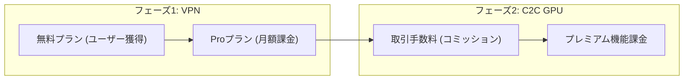

# 競合分析 ＆ マネタイズ計画書：InstantMesh

本書では、InstantMeshの競合となるサービスを「VPN領域」「ローカルAI接続領域」「将来のC2C GPU領域」の3軸で分析し、InstantMeshならではのマネタイズ戦略を提案します。

> **2026-07-27 改訂**: プロダクトの前面を「ローカルAI／MCP の一時貸与」へ寄せた方向転換（`docs/要件定義書.md` 付録C）に伴い、§1.5（ローカルAI接続領域の競合）を新設し、§3.2 の料金プラン案を「量課金」から「統制課金」へ改訂しました。数値は要件定義書 §5（唯一のマスター）に準拠します。

---

## 1. 競合分析：VPN領域（フェーズ1の競合）

### 1.1. 競合サービス比較表

| 項目 | **Tailscale** | **ZeroTier** | **NetBird** | **InstantMesh（本プロダクト）** |
| :--- | :--- | :--- | :--- | :--- |
| **概要** | WireGuardベースのメッシュVPN。企業向けに急成長中 | 独自プロトコルのP2P仮想LAN。老舗 | WireGuardベースのオープンソースZero Trust VPN | WireGuardベースの即席VPN。アカウントレス＆一時利用特化 |
| **ターゲット** | 開発者 → 企業のIT部門 | 個人・IoT・中小企業 | セキュリティ重視の中〜大企業 | **ローカルAI／MCP を扱う開発者・小規模チーム** |
| **アカウント** | 全員必要（Google/Microsoft等） | 全員必要 | 全員必要（SSO/IdP） | **ホストのみ。ゲストはアカウント不要** |
| **ネットワーク寿命** | 永続的（常時接続） | 永続的 | 永続的 | **一時的（エフェメラル）。時間制限で自動消滅** |
| **共有の粒度** | ネットワーク境界まで | 同左 | 同左 | **サービス単位＋ゲスト単位の制御・記録** |
| **無料プラン** | **6ユーザーまで無料**（個人向け有料プランは廃止） | 10ノードまで無料 | 5ユーザー・100台まで無料 | **基本無料（リレー通信量制限あり）** |
| **収益モデル** | シート課金（PLG → Enterprise） | ノード数課金（Freemium） | アクティブユーザー課金 | **後述（フリーミアム＋将来のGPU手数料）** |
| **技術基盤** | WireGuard + DERP（独自リレー） | 独自プロトコル (ZT) | WireGuard + STUN/TURN | WireGuard + STUN + DERP 相当の自前リレー（TURN は未実装） |
| **セルフホスト** | 不可（コントロールプレーンはSaaS） | 可能（ztncui等） | 可能（全機能無料） | フェーズ1では不可（SaaS提供） |

### 1.2. InstantMeshの差別化ポイント

既存の競合サービスは全て「**永続的なネットワークを構築し、全員がアカウントを持つ**」ことを前提としています。InstantMeshは以下の点で根本的に異なります。

1.  **アカウントレス参加（ゲスト）**
    * 競合は全員がサービスにサインアップする必要があるため、「ちょっとだけ一緒にLAN接続したい」というカジュアルな利用シーンにはオーバースペックです。
    * InstantMeshは、ゲストはQRコードを読むだけで即座に参加できます。

2.  **使い捨て（エフェメラル）ネットワーク**
    * 競合は「永続的なネットワーク」を管理するツールです。使い終わったら手動でピアを削除したり、ネットワークをアーカイブする必要があります。
    * InstantMeshは、制限時間経過で自動的にネットワークが消滅し、痕跡が一切残りません。

3.  **ユースケースの違い**
    * 競合：企業のリモートアクセス、DevOps、IoTデバイス管理（常時稼働が前提）
    * InstantMesh：**開発中のローカルLLM／MCP サーバーの一時共有、客先デモ、ハッカソン、臨時の共同作業**（一時利用が前提）

### 1.3. 競合の課金軸（何を有料にしているか）

差別化ポイントよりも重要なのが「**競合が実際に何で金を取れているか**」です。2026年7月時点の実態は以下のとおりで、`docs/要件定義書.md` §5 の課金軸改訂はこの調査に基づきます。

| | ngrok | Tailscale |
| :--- | :--- | :--- |
| **無料枠** | 3エンドポイント / 1GB / 20,000リクエスト / 1ユーザー。**セッション時間制限は撤廃済み**（常駐可） | **6ユーザーまで無料**（意図的に寛容） |
| **最大の課金ドライバ** | **無料版の警告ページ（interstitial）** — 自分の不便ではなく「**相手に出せない**」 | 組織向けの**統制と証跡**（SSO/SCIM・監査ログ・フローログ・SIEM連携・デバイスポスチャ） |
| **ロックインの機構** | **独自ドメイン持ち込み** — Stripe の webhook 設定や OAuth redirect URI といった**他人の設定に刻まれる** | SSO 連携・SIEM ストリーム（解約すると組織の運用が壊れる） |
| **重要な事実** | 時間による区切りを課金軸から**外した** | **個人向け有料プラン「Personal Plus」を廃止**。「必要だからではなく応援したいから契約していた」ことを理由に挙げている |

**導出される3法則**:

1. **課金するのは「他人が絡む地点」。** 自分の快適さは無料側に置く。
2. **他人の設定に刻まれるものを売る。** 解約すると自分以外の何かが壊れる。
3. **個人向けに「量を増やしただけ」の有料プランは成立しない。** Tailscale が実際に試して畳んでいる。

---

## 1.5. 競合分析：ローカルAI接続領域（方向転換後の主戦場）

### 1.5.1. 状況

**「経路」はすでに無料で埋まっています。** Tailscale は自社ブログで「Self-host a local AI stack and access it from anywhere」「Why it's so easy to find open, exposed AI servers on the web」を公開しており、ローカルAIへのリモートアクセスという用途を**名指しで訴求済み**です。個人が自宅/オフィスのGPUに外から繋ぐ用途は、彼らの無料枠で足ります。

**埋まっていないのは「共有した先」です。** Tailscale の推奨パターンは *VPN as trusted perimeter*（ネットワークに居れば認証済みとみなす）で、本番寄りの構成については「API レベルの RBAC と TLS は nginx や API ゲートウェイを自分で立てて足せ」と明記されています。

そして需要の証拠があります。**Ollama には認証機構が存在せず**、SentinelOne と Censys の調査（2026年1月）では無認証・ファイアウォールなしの Ollama ホストが **130カ国で175,000台**公開されていました。

### 1.5.2. MCP 領域

| 指標 | 2026年時点 |
| :--- | :--- |
| 本番運用AIチームの MCP 採用率 | **78%** |
| 公開レジストリのサーバー数 | **9,400超**（SDK ダウンロード 月間約9,700万） |
| 認証 | 2025年11月仕様で **OAuth 2.1 を正式化**（＝認証はプロトコル層で解決済み） |
| 配置の趨勢 | 検索上位サーバーの**約8割がベンダーホストのリモート**。企業は中央で統制しやすい配置を選好 |
| 競合カテゴリ | **エンタープライズMCPゲートウェイ**が成立（十数社） |
| セキュリティ | 1,808サーバーの**66%に何らかの発見**（コマンドインジェクション43%・パストラバーサル82%・SSRF 36.7%） |

**含意**: 社内MCPは確実に伸びるが、伸びる方向は**中央集約**であり、そこは MCPゲートウェイ各社の領域です。また MCP は認証を標準化済みのため、**Ollama に有効な「外付けの認証」は MCP には効きません**（この2つを同じ機能で語ってはいけません）。

### 1.5.3. InstantMesh が取れる隙間

正面から戦わない領域を明確にした上で（`docs/vision.md` §4）、狙うのは以下に限定します。

* **中央ゲートウェイに登録される前**の MCP サーバー（作者のノートPCで動いている段階のレビュー・デモ）
* **中央に載せられないもの**（手元のファイル・開発中のDB・外に出せないオンプレ機器を触る MCP）
* **集約が遅れる推論エンドポイント**（GPUは高価で分散し、そもそもデータを外に出さないためにローカルに置かれている）
* **信用できない第三者製サーバー**を、隔離された一時的な網の中でだけ動かす用途

競合が構造的に入りにくい理由は、**MCPゲートウェイ各社が「常設・中央・無人」を前提としており、Tailscale は「常設 tailnet ＋全員アカウント」を前提としている**ためです。「一時的・アカウントレス・承認制」はどちらの前提にも当てはまりません。

---

## 2. 競合分析：C2C GPU領域（将来フェーズの競合）

### 2.1. 競合サービス比較表

| 項目 | **Vast.ai** | **Akash Network** | **io.net** | **Aethir** |
| :--- | :--- | :--- | :--- | :--- |
| **概要** | 分散型GPUマーケットプレイス | ブロックチェーン基盤の汎用クラウド | AI/ML特化の分散GPUクラスター | エンタープライズ向け分散GPU |
| **ホスト（貸し手）** | 個人〜データセンター | Kubernetesに精通した提供者 | データセンター中心 | 大規模インフラ事業者 |
| **収益モデル** | 取引手数料（コミッション） | リバースオークション | オンデマンド課金 | エンタープライズ契約 |
| **規模（2026年）** | GPU 約20,000基、月間14,000+有料ユーザー | 確立された実績あり | AI/ML特化で急成長 | 大規模推論・クラウドゲーミング |
| **価格帯** | AWS比 3〜5倍安い（動的価格） | オークション方式で変動 | オンデマンド（AWS比で安価） | AWS比 40〜80%安い |
| **参入障壁** | 低い（個人PCでも提供可） | 高い（Kubernetes知識が必要） | 中程度 | 高い（エンタープライズ向け） |

### 2.2. InstantMeshが将来参入する際の差別化

* **「ネットワーク接続」の問題を解決済み**: 既存のGPUマーケットプレイスは、借り手がホストのGPUマシンに接続するためにSSHトンネルやポート転送などの設定が必要です。InstantMeshは、NATの壁を超えてポート開放不要で即座にセキュアな接続を構築できるため、接続のUXで圧倒的に優位になります。
* **個人ユーザーへの低い参入障壁**: Vast.aiは「Dockerイメージの選択」「Jupyter Notebookの起動」など一定のリテラシーが求められます。InstantMeshは「QRコードを読むだけ」というシンプルさを武器に、より幅広い個人ユーザーを取り込める可能性があります。

---

## 3. マネタイズ戦略

### 3.1. 全体方針：段階的フリーミアム ＋ プラットフォーム手数料

```mermaid
graph LR
    subgraph Phase1 ["フェーズ1: VPN"]
        Free["無料プラン (ユーザー獲得)"]
        Pro["Proプラン (月額課金)"]
    end
    
    subgraph Phase2 ["フェーズ2: C2C GPU"]
        Fee["取引手数料 (コミッション)"]
        Premium["プレミアム機能課金"]
    end

    Free --> Pro
    Pro --> Fee
    Fee --> Premium
```

---

### 3.2. フェーズ1：VPNサービスのマネタイズ

#### 料金プラン案（2026-07-27 改訂：量課金 → 統制課金）

| プラン | 価格 | 内容 |
| :--- | :--- | :--- |
| **Free** | ¥0 | ローカルサービス共有（**同時1つ**）、待合室承認・キック・SAS照合・招待URL再発行・E2E は全機能利用可、最大5ゲスト、制限時間 最大1時間、リレー 100MB/接続（超過後 64kbps へ速度制限） |
| **Pro**（個人・小チーム向け） | ¥500〜800/月 | 上記に加えて **同時10サービス共有・利用記録の閲覧・ゲストごとのアクセスキー・ゲストごとの上限設定**、最大20ゲスト、制限時間 最大24時間、リレー制限緩和（または従量課金） |

> 数値は `docs/要件定義書.md` §5（唯一のマスター）に準拠。**Team（チーム向け）プランは将来構想であり未実装**（現行はティア判定 Free/Pro の 2 段階のみ）。

#### 改訂の要点：何を売るのか

**Free =「貸せる」／ Pro =「誰にどれだけ貸したかを制御・記録できる」。**

改訂前は「ゲスト数 5→20 / 制限時間 1h→24h / リレー 100MB→無制限」という**量の増量だけ**でした。これを §1.3 の3法則に照らして組み替えています。

* **法則①（他人が絡む地点で課金）** … 自分1人で使うなら利用記録もアクセスキーも不要。**他人に貸した瞬間に必要になる**
* **法則②（他人の設定に刻まれる）** … ゲストに配ったアクセスキーは相手のアプリや CI に書かれるため、解約すると相手側が壊れる
* **法則③（量的増量は成立しない）** … Tailscale が Personal Plus 廃止で実証済み。よって量は主要な差別化軸から外す

#### 無料プランの戦略的意義（PLG: Product-Led Growth）
* **「まず無料で使ってもらい、便利さを体感してもらう」** ことでオーガニックな口コミ拡大を狙います。
* 「5人まで・1時間まで」という制限は、**ローカルAI共有という主用途を無料版で成立させなくする**副作用を持ちます（実作業は半日〜1日）。ただし数値の緩和は AWS のデータ転送コストに直結するため、**実測前の変更は行わず保留**としています（要件定義書 付録C.8）。Pro への誘導は量ではなく「他人に貸すときの統制」で行います。
* **セキュリティ機能は無料に置きます。** 承認・キック・SAS照合・E2E を有料化すると「安全に共有できる」という訴求そのものが崩壊するためです。

#### 追加の収益オプション
* **ワンタイムパス（都度課金）**: 「1回だけ大人数・長時間で使いたい」という**サブスクに向かない需要**の受け皿。¥300〜500の単発パス。イベントやハッカソン向け。
    * 位置づけ: サブスクを安くする案ではなく、**サブスクに向かない需要をサブスクから切り離す**案です。量的な上限はこちらで、継続課金は統制機能で取ります。
    * 実装前提: 現行の `pkg/plan.TierForGroups` は Cognito グループの在／不在で判定し**期限の概念を持たない**ため、ティア判定を**ルーム作成時に確定してルームへ焼き付ける**設計変更が必要です（要件定義書 付録C.4）。

---

### 3.3. フェーズ2：C2C GPUプラットフォームのマネタイズ

#### 収益モデル：取引手数料（コミッション）

Vast.aiと同様の**マーケットプレイス手数料モデル**を採用します。

| 収益源 | 内容 | 手数料率の目安 |
| :--- | :--- | :--- |
| **取引手数料** | GPU貸し借りが成立した際、貸し手の売上から一定割合を徴収 | 10〜15% |
| **プレミアムリスティング** | 貸し手が検索結果の上位に表示されるための広告費 | 月額固定 or 入札制 |
| **エスクロー（決済保証）** | 借り手の支払いを一時的にプラットフォームが預かり、GPUの稼働確認後に貸し手へ支払う安心取引機能 | 手数料に含む |

#### なぜ手数料モデルが最適か
* **ハードウェアを持たない（資本軽量モデル）**: Vast.aiと同様に、InstantMeshは自前でGPUを保有せず、ソフトウェア（VPN接続＋マッチング）のみを提供するため、固定費が低く利益率が高くなります。
* **ネットワーク効果**: 貸し手が増えれば借り手が集まり、借り手が増えれば貸し手が増えるという好循環が生まれます。

---

## 4. 収益シミュレーション（初年度の目安）

### フェーズ1（VPN）

| 指標 | 保守的シナリオ | 楽観的シナリオ |
| :--- | :--- | :--- |
| 無料ユーザー数 | 5,000人 | 20,000人 |
| Pro有料転換率 | 3% | 5% |
| Pro有料ユーザー数 | 150人 | 1,000人 |
| Pro月額単価 | ¥500 | ¥800 |
| **月間売上** | **¥75,000** | **¥800,000** |
| **年間売上** | **¥900,000** | **¥9,600,000** |

> [!NOTE]
> フェーズ1の目的は「大きな利益を出すこと」ではなく、「ユーザーベースの獲得」と「P2P通信技術の実績づくり」です。AWSインフラコストを無料プランの制限（リレー累計上限＋純アイドル30分の自動解散）で抑えながら、将来のGPUプラットフォームへの土台を築きます。

> [!WARNING]
> **上記シミュレーションは 2026-07-27 の方向転換より前の前提（量課金・カジュアル層含む）に基づいており、未更新です。** 転換後は狙う市場が「中央ゲートウェイに載る前／載せられないローカルAI・MCP の一時共有」に意図的に限定されるため、**無料ユーザー数の想定は下振れし、有料転換率は上振れする**方向に前提が変わります。転換率は WTP 未検証（要件定義書 付録C.5）のため、実測後に本節を書き換えます。

---

## 5. まとめ：InstantMeshの競争優位性

| 観点 | 既存競合 | InstantMesh |
| :--- | :--- | :--- |
| **参加の手軽さ** | 全員がアカウント登録必須 | ゲストはQR/リンクだけ（アカウント不要） |
| **ネットワークの性質** | 永続的（管理コストが発生） | 一時的（自動消滅でゼロ管理） |
| **共有の粒度** | ネットワーク境界まで（居れば認証済み） | **サービス単位で貸し、ゲスト単位で制御・記録** |
| **ゲスト側の設定変更** | 接続先アドレスの再設定が必要 | **不要**（ポート保存で `127.0.0.1:11434` のまま） |
| **主要ターゲット** | 企業のIT部門・DevOps | ローカルAI／MCP を扱う開発者・小規模チーム |
| **将来の拡張性** | VPN/ネットワークに留まる | C2C GPUプラットフォームへの展開が可能 |

> **競争優位性の限界（正直な評価）**: 経路の提供では Tailscale・Cloudflare Tunnel が無料で先行し、社内MCPの中央ガバナンスでは MCPゲートウェイ各社が先行しています。上表の優位性が成立するのは両者の**隙間に限定した場合のみ**であり、市場規模は小さくなります（要件定義書 付録C.5）。
